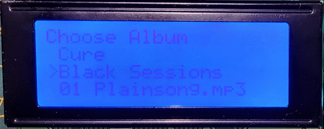
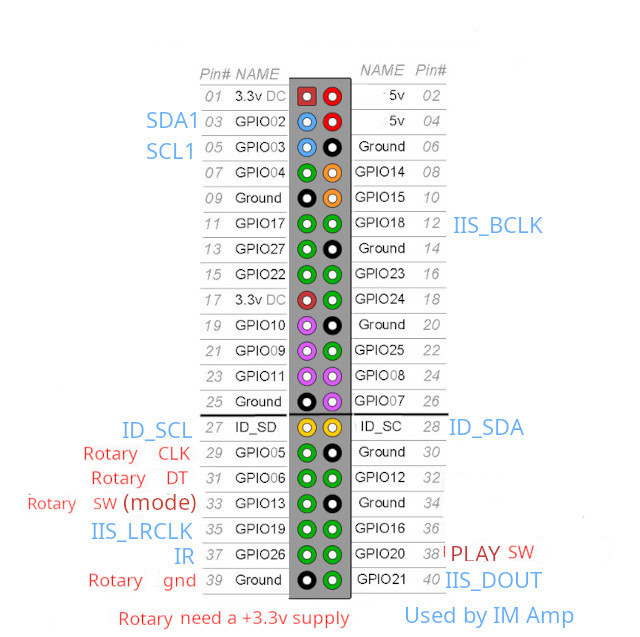

# PI_LCD_MP3_player

Not for BOOKWORM 32bit, works with 64bit. Tested on TRIXIE 64bit

A simple MP3 Player and Internet Radio Player using a Raspberry Pi, 1 I2C 2x16 or 4x20 LCD, a KY-040 rotary encoder and a switch to gnd.

At boot it will look for mp3 tracks in '/home/USERNAME/Music/artist name/album_name/tracks', and/or on a USB stick, under /media/USERNAME/usb_stick_name/artist name/album_name/tracks

Press rotary encoder button to choose mode to choose Artist/ Album / Track or set Volume, SLEEP, Shuffle or gapless modes. use rotary to set.
press PLAY button to play / stop mp3, or hold for > 5 seconds to choose Radio, use rotary to select station.
## Screenshot

## Connections

To install copy LCD_MP3_player.py to /home/USERNAME

and then

sudo apt-get install python3-alsaaudio

sudo pip3 install rpi_lcd (--break-system-packages)

sudo apt-get install mplayer

sudo pip3 install mutagen (--break-system-packages)

enable i2c, Menu >> Preferences >> Raspberry Pi Configuration >> Interfaces >> i2c enable

to run python3 LCD_MP3_player.py

to start at boot, if using X11, add /usr/bin/python3 /home/USERNAME/LCD_MP3_player.py to /etc/xdg/lxsession/LXDE-pi/autostart and ensure your Pi boots to the GUI

