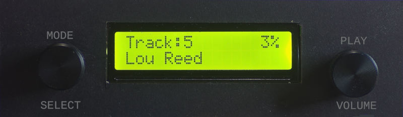
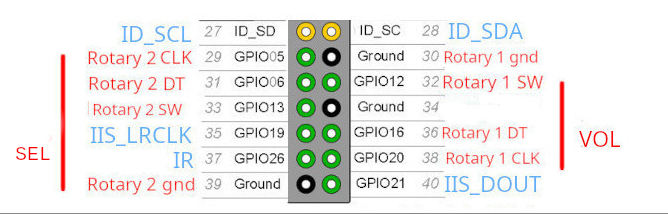

# PI_LCD_MP3_player

Not for BOOKWORM 32bit, works with 64bit. Tested on TRIXIE 64bit

A simple MP3 Player and Internet Radio Player using a Raspberry Pi, 1 I2C 2x16 or 4x20 LCD, 2 x KY-040 rotary encoders.

At boot it will look for mp3 tracks in '/home/USERNAME/Music/artist name/album_name/tracks', and/or on a USB stick, under /media/USERNAME/usb_stick_name/artist name/album_name/tracks

Press SELECT rotary encoder button to choose mode to choose Artist/ Album / Track, SLEEP, Random, Album mode, Gapless modes or BOOT mode.

Use SELECT rotary to set, then press PLAY button (on VOLUME rotary) to play / stop mp3, or hold for > 5 seconds to choose Radio, use SELECT rotary to select Radio station.

## Front Panel

## Connections

To install:

Setup your audio amd internet connection as required.

Copy LCD_MP3_player.py to /home/USERNAME

(NOTE: I am suggesting the use of --break-system-packages, this shouldn't be an issue if using this in a standalone
pi BUT if not then learn how to use venv !!)

and then

sudo apt-get install python3-alsaaudio

sudo pip3 install rpi_lcd --break-system-packages

sudo apt-get install mplayer

sudo pip3 install mutagen --break-system-packages

enable i2c, Menu >> Preferences >> Control Centre >> Interfaces >> i2c enable

to run python3 LCD_MP3_Player.py

to start at boot, if using X11, add /usr/bin/python3 /home/USERNAME/LCD_MP3_player.py to /etc/xdg/lxsession/LXDE-pi/autostart and ensure your Pi boots to the GUI

or if using labwc...

(note: change USERNAME to your username)

sudo nano /home/USERNAME/.config/labwc/autostart

type in...

/usr/bin/python3 /home/USERNAME/LCD_MP3_player.py

press Ctrl and X, Y, return to save..

Reboot
