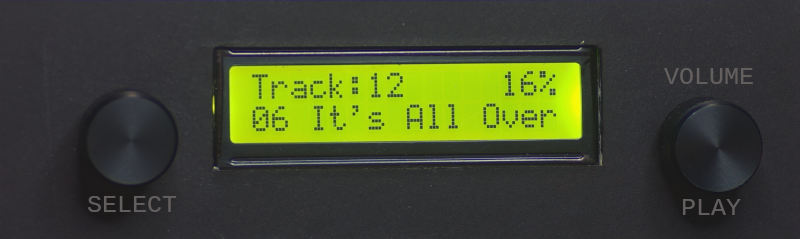
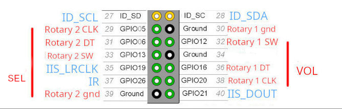
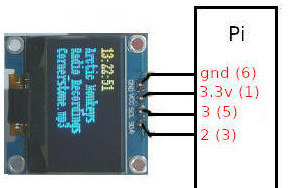
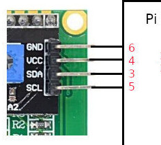

# PI_LCD_MP3_player

Not for BOOKWORM 32bit, works with 64bit. Tested on TRIXIE 64bit

A simple MP3 Player and Internet Radio Player using a Raspberry Pi, 1 I2C 2x16 or 4x20 LCD, 2 x KY-040 rotary encoders.

At boot it will look for mp3 tracks in '/home/USERNAME/Music/artist name/album_name/tracks', and/or on a USB stick, under /media/USERNAME/usb_stick_name/artist name/album_name/tracks

Rotating the SELECT rotary encoder will choose between >Set Artist A-Z,>Set Artist,>Set Album,>Set Track,>Set SLEEP,>Set RANDOM,>Set GAPLESS,>Set ALBUM MODE,>Set BOOT MODE,>RELOAD TRACKS

Pressing the SELECT rotary button will allow you to set the required options with the SELECT rotary encoder, press the SELECT rotary button to return.

Pressing the PLAY button will play the selected MP3, or hold it down for 5 seconds to choose Internet Radio, press again to STOP.

Rotating the PLAY rotary encoder will set the VOLUME.

Rotating the SELECT rotary encoder whilst playing will select the NEXT / PREVIOUS Track / Radio Station.

Pressing the SELECT rotary button whilst playing will let you set SLEEP time with the rotary, pressing again if playing MP3s will let you set GAPLESS ON / OFF.

Selecting ALBUM MODE will play the selected ALBUM and then stop. Setting SLEEP ON in ALBUM MODE will set the sleep timer to the length of the album.

BOOT MODES are STOPPED, MP3 PLAY or RADIO.

## Front Panel 

## Connections

## SSD1306

## 16x2 or 20x4 LCD

To install:

Setup your audio and internet connection as required.

Copy LCD_MP3_player.py to /home/USERNAME

(NOTE: I am suggesting the use of --break-system-packages, this shouldn't be an issue if using this in a standalone
pi BUT if not then learn how to use venv !!)

and then

# For 16x2 or 20x4 LCD

sudo pip3 install rpi_lcd --break-system-packages

# To install SSD1306 driver...

    sudo pip3 install adafruit-circuitpython-ssd1306 --break-system-packages
    
    sudo pip3 install adafruit-blinka --break-system-packages
    
    sudo pip3 install pillow --break-system-packages

sudo apt-get install python3-alsaaudio

sudo apt-get install mplayer

sudo pip3 install mutagen --break-system-packages

enable i2c, Menu >> Preferences >> Control Centre >> Interfaces >> i2c enable

to run python3 LCD_MP3_Player.py

to start at boot, if using X11, add /usr/bin/python3 /home/USERNAME/LCD_MP3_player.py to /etc/xdg/lxsession/LXDE-pi/autostart and ensure your Pi boots to the GUI

or if using labwc...

(note: change USERNAME to your username)

sudo nano /home/USERNAME/.config/labwc/autostart

type in...

/usr/bin/python3 /home/USERNAME/LCD_MP3_player.py

press Ctrl and X, Y, return to save..

Reboot
